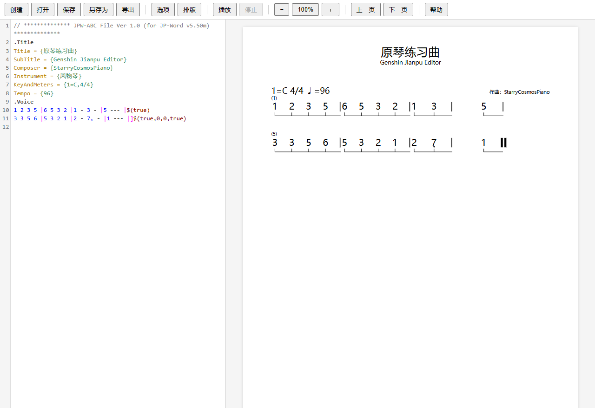

<div align="center">

# 原琴简谱编辑器

### Genshin Jianpu Editor

面向原神琴谱制作的开源简谱编辑、MIDI 转谱与排版工具<br>
An open-source jianpu editor, MIDI converter, and score typesetter for Genshin musicians

[](https://starrycosmospiano.github.io/genshin-jianpu-editor/)
[](#快速开始)
[](LICENSE)
[](https://www.typescriptlang.org/)

[中文](#中文) · [English](#english)

</div>



## 中文

### 项目简介

**原琴简谱编辑器**用于把 MIDI、键盘谱、数字斜杠谱、MusicXML、ABC
记谱和简谱图片整理成可继续编辑、播放和导出的数字简谱。它特别适合制作原神风物之诗琴等乐器使用的
琴谱，同时也可以作为通用的 JP-Word / `.jpwabc` 简谱排版工具。

左侧是带语法高亮的文本编辑器，右侧是实时 SVG 乐谱预览。修改音符后会立即重新排版，也可以直接在
谱面上点选、改音、调整八度和控制播放位置。

### 主要功能

- **MIDI 智能转简谱**：自动分析节拍、调号、BPM 和量化精度，支持 4 / 8 / 16 /
  32 / 64 分音符、三连音、和弦、倚音、琶音、延音与跨小节长音。
- **原琴常用文本谱**：支持键盘谱 TXT 和数字斜杠谱 TXT，可自定义键位、时值字符、
  括号和弦、多个同步声部，并在文本与谱面之间双向定位。
- **钢琴双手与多轨总谱**：支持 `.Voice.RH` / `.Voice.LH` 双行简谱，以及多乐器、多声部
  的同步排版、播放和分轨 MIDI 导出。
- **多格式导入**：支持 `.jpwabc`、MIDI、MusicXML、ABC、键盘谱、数字谱以及 PNG / JPG /
  PDF 简谱图像。
- **简谱图像识别（OMR）**：浏览器和桌面端均可使用本地 PaddleOCR 模型识别数字、歌词与页眉，
  并提供原图叠加核对视图。
- **实时 SVG 排版**：A4 / A3 / 16:9 / 4:3 页面、横竖版、自动分页、节奏刻度线、标题与词曲信息、
  八度点、升降号、和弦、延音线和花括号均可调整。
- **播放与自定义音源**：支持默认播放音源和用户自行添加的 SF2 音源。
- **多格式导出**：PDF、PNG、MIDI、矢量 PPTX、JPW、键盘谱 TXT 和数字谱 TXT。
- **跨平台**：可直接在浏览器中运行，也可构建 Windows / macOS 桌面应用。

### 音源说明

仓库和发行包**不分发任何原神游戏音频或第三方 SF2 文件**，但程序完整支持 SF2 播放：

1. 桌面版打开「选项 → 播放音源（SF2）」。
2. 点击「打开音源文件夹」。
3. 放入你有权使用的 `.sf2` 文件。
4. 返回程序点击「刷新音源」，然后选择音色。

从源码构建网页端时，也可以把自备的 `.sf2` 文件放入
`src/assets/soundfonts/` 后重新构建；该目录中的 SF2 文件已被 Git 忽略。

### 快速开始

在线版：

<https://starrycosmospiano.github.io/genshin-jianpu-editor/>

本地运行需要 Node.js 20 或更高版本：

```bash
git clone https://github.com/StarryCosmosPiano/genshin-jianpu-editor.git
cd genshin-jianpu-editor
npm ci
npm run dev
```

生产构建与桌面端：

```bash
npm run build
npm run tauri dev
```

Windows 用户也可以双击根目录的 `启动网页端.cmd` 启动网页端开发服务器。

### 示例文件

- [`Avid - 86 -不存在的战区.mid`](examples/Avid%20-%2086%20-%20不存在的战区.mid)：MIDI 智能量化与转谱示例。
- [`piano-demo.jpwabc`](examples/piano-demo.jpwabc)：钢琴左右手双行简谱。
- [`multitrack-ensemble.jpwabc`](examples/multitrack-ensemble.jpwabc)：多乐器、多声部总谱。

### 常用命令

```bash
npm run dev          # Vite 开发服务器
npm run build        # TypeScript 严格检查 + Web 构建
npx tsc --noEmit     # 仅运行类型检查
npm run tauri dev    # 启动 Tauri 桌面应用
```

更多开发与回归命令见 [docs/开发.md](docs/开发.md)，技术架构见
[docs/技术栈.md](docs/技术栈.md)。

### 开源来源与致谢

本项目基于 [lodebar2026/jpeditor](https://github.com/lodebar2026/jpeditor)
进行二次开发，保留其 Git 历史、原作者版权声明和 MIT 许可证。感谢原项目完成的
JP-Word 解析、SVG 排版、MusicXML / ABC / OMR 等基础能力。

项目还使用了 Bravura、PaddleOCR、Willem G. Vree 的 `abc2xml` 及其他开源组件。
详细来源和许可证见 [THIRD_PARTY_NOTICES.md](THIRD_PARTY_NOTICES.md)。

### 许可证

项目主体按 [MIT License](LICENSE) 发布。第三方字体、模型和移植代码分别遵循其原许可证。

---

## English

### About

**Genshin Jianpu Editor** turns MIDI, keyboard notation, slash-number notation,
MusicXML, ABC notation, and jianpu images into editable numbered scores. It is
designed for preparing music for Genshin instruments while remaining a
general-purpose JP-Word / `.jpwabc` editor and typesetter.

The source editor on the left and the live SVG preview on the right stay in
sync. Notes can also be selected and edited directly on the rendered score.

### Highlights

- **Smart MIDI-to-jianpu conversion** with beat, key, tempo, quantization,
  triplet, chord, grace-note, arpeggio, tie, and cross-measure note handling.
- **Keyboard and slash-number TXT formats** with configurable key mappings,
  duration symbols, chords, and synchronized voices.
- **Paired right/left-hand and multi-track scores** with synchronized layout,
  playback, and multi-track MIDI export.
- **Imports** `.jpwabc`, MIDI, MusicXML, ABC, keyboard TXT, numbered TXT, and
  jianpu images in PNG, JPG, or PDF format.
- **Local OMR** powered by PaddleOCR for notes, lyrics, and header metadata,
  with an overlay view for proofreading.
- **Live SVG engraving** with configurable page formats, pagination, rhythmic
  guides, titles, credits, octave dots, accidentals, chords, ties, and braces.
- **Playback with optional user-provided SF2 SoundFonts**.
- **Exports** PDF, PNG, MIDI, vector PPTX, JPW, keyboard TXT, and numbered TXT.
- **Cross-platform** Web, Windows, and macOS support through Vite and Tauri 2.

### SoundFonts

The repository and release packages **do not distribute Genshin Impact audio
or third-party SF2 files**. SF2 playback is supported through user-provided
files:

1. In the desktop app, open **Options → Playback source (SF2)**.
2. Select **Open SoundFont folder**.
3. Add an `.sf2` file you are permitted to use.
4. Refresh the catalog and select the instrument.

For a local web build, authorized `.sf2` files may be placed in
`src/assets/soundfonts/` before building. They are ignored by Git.

### Getting started

Try the web app:

<https://starrycosmospiano.github.io/genshin-jianpu-editor/>

Run from source with Node.js 20 or newer:

```bash
git clone https://github.com/StarryCosmosPiano/genshin-jianpu-editor.git
cd genshin-jianpu-editor
npm ci
npm run dev
```

Build the web or desktop app:

```bash
npm run build
npm run tauri dev
```

### Examples

- [`Avid - 86 -不存在的战区.mid`](examples/Avid%20-%2086%20-%20不存在的战区.mid)
  for MIDI quantization and score conversion.
- [`piano-demo.jpwabc`](examples/piano-demo.jpwabc) for paired right/left-hand
  jianpu.
- [`multitrack-ensemble.jpwabc`](examples/multitrack-ensemble.jpwabc) for
  multi-instrument, multi-voice layout.

### Open-source foundation

This project is derived from
[lodebar2026/jpeditor](https://github.com/lodebar2026/jpeditor). Its Git
history, original copyright notice, and MIT license are retained.

Bravura, PaddleOCR, Willem G. Vree's `abc2xml`, and other open-source
components are also used. See
[THIRD_PARTY_NOTICES.md](THIRD_PARTY_NOTICES.md) for attribution and license
details.

### License

The main project is distributed under the [MIT License](LICENSE). Bundled
third-party fonts, models, and ported components remain under their respective
licenses.
